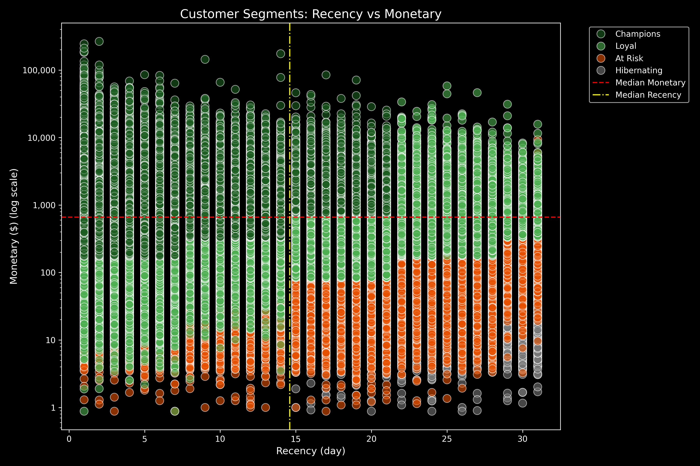
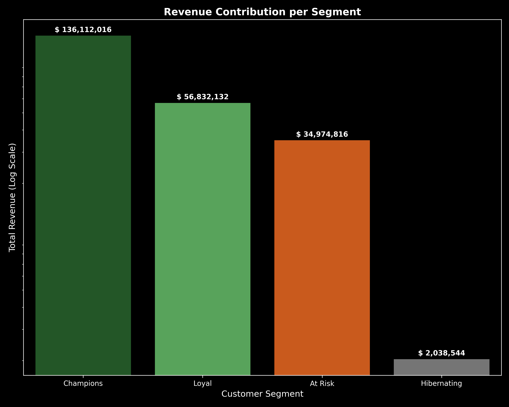

# E-Commerce Customer Behavior & RFM Segmentation

This project presents an **end-to-end data analytics and data engineering pipeline** for analyzing large-scale e-commerce behavioral data (~42 million rows). 
It covers the complete workflow from **exploratory data analysis (EDA)** to **efficient data processing**, **optimized storage**, and **customer segmentation using RFM analysis**.

The project emphasizes **scalability, performance, and clean analytical design**, making it suitable for real-world analytics and data engineering scenarios.

---

## 📁 Project Structure

```
customer-behavior-analysis/
├── data/
│ ├── Gold-Data/ # Final RFM segmentation outputs (Parquet)
│ ├── sample.parquet # 100k-row optimized sample for fast EDA
│ └── 2019-Oct_chunk.parquet # Optimized full dataset (Silver layer)
│
├── notebooks/
│ ├── 00_Initial_EDA.ipynb # Behavioral & temporal exploration
│ ├── 01_Data_Optimization.ipynb # Memory-efficient CSV → Parquet conversion
│ └── 02_RFM_Segmentation.ipynb # RFM scoring & customer segmentation
│
├── src/
│ └── Utils.py # Reusable helper functions
│
├── outputs/
│ └── plots/ # Generated visual insights
│
├── requirements.txt # Project dependencies
└── README.md
```

---

## 📈 Project Workflow

### 1. Exploratory Data Analysis  
**Notebook:** `00_Initial_EDA.ipynb`

This notebook provides an initial understanding of customer behavior and purchasing patterns.

**Key analyses include:**
- Conversion funnel analysis (view → purchase)
- Temporal trends such as peak shopping hours and active weekdays
- Distribution of user activity and events

**Performance optimization:**
- Refactored to use `sample.parquet` instead of the full 6GB dataset
- Enables fast execution while preserving analytical validity

---

### 2. Data Engineering & Optimization  
**Notebook:** `01_Data_Optimization.ipynb`

This step addresses the challenge of processing **42 million rows** of raw event data efficiently.

**Key techniques:**
- Chunk-based processing (500k rows per chunk) to control memory usage
- Data type downcasting (e.g., `int32`, `float32`)
- Timestamp standardization and missing value handling using categorical encoding

**Storage optimization:**
- Converted raw CSV files to **Apache Parquet** format with **Snappy compression**
- Achieved approximately **75% reduction in storage size**
- Established a clean and optimized **Silver data layer**

---

### 3. RFM Segmentation  
**Notebook:** `02_RFM_Segmentation.ipynb`

This notebook transforms raw behavioral events into **actionable customer insights** using RFM analysis.

**RFM metrics calculated per user:**
- **Recency:** Time since last purchase
- **Frequency:** Number of purchase events
- **Monetary:** Total spending

**Hybrid scoring approach:**
- **Recency:** Business-rule-based binning using `pd.cut`
- **Frequency & Monetary:** Quantile-based scoring using `pd.qcut`

**Customer segments include:**
- Champions  
- Loyal Customers  
- At Risk  
- Hibernating  

Final results are stored as **Gold-layer Parquet files**, ready for BI tools or further analytics.

---
### 4. Advanced Visualization & Business Branding
**Notebook:** `03_RFM_Visualization.ipynb`  
The final stage focuses on executive-level reporting and communicating complex data insights through professional branding.

**Key Technical Implementations:**
- **Semantic Branding**: Implementation of a custom color palette to represent segment health (e.g., Deep Green for high-value *Champions*, Burnt Orange for *At-Risk*).
- **Logarithmic Scaling**: Applied to both Scatter and Bar charts to handle extreme variance in spending ($2M vs $136M) and ensure all segments are visible.
- **Z-Order Layering**: Strategic data sorting (`ascending=False`) during plotting to ensure high-priority points (Champions) are never obscured by other layers.
- **Executive Reporting**: 
    - Inclusion of **Median Thresholds** to define business quadrants.
    - Automated plot saving with high-resolution output for stakeholders.

---
### 📊 Key Visualizations

#### 1. Strategic Segmentation (RFM Scatter Plot)
This plot identifies the boundaries between customer segments using log-scaling and median thresholds.


#### 2. Revenue Contribution (Bar Chart)
A financial breakdown showing how the Champions segment drives the majority of total revenue.

---

## 💡 Strategic Business Findings

Based on the final analytical models, these are the top 3 financial insights extracted from the data:

* **The Revenue Anchor**: The **Champions** segment, while not necessarily the largest in customer count, acts as the primary revenue engine, contributing **$136.1 Million**. This highlights a high dependency on top-tier customer retention for business stability.
* **The "Hidden" Opportunity in At-Risk**: There is approximately **$35 Million** in "Locked Revenue" within the **At-Risk** segment. Successfully moving just 10% of these customers back to the **Loyal** category could result in a **$3.5 Million** immediate revenue boost.
* **Cost-Efficient Focus**: The **Hibernating** segment contributes only **$2 Million** (less than 1.5% of Champions). This insight suggests that the marketing budget should be heavily skewed toward **Champions** and **Loyal** segments, with only low-cost, automated re-engagement for Hibernating users.

---


## 🛠 Modular Utilities (`src/Utils.py`)

To improve code readability and maintainability, repetitive logic is centralized in `Utils.py`.

**Example utility:**
- `save_plot()`  
  - Standardizes plot exports  
  - Automatically creates output directories  
  - Saves high-resolution, publication-ready figures  

This approach follows **DRY (Don’t Repeat Yourself)** and clean code principles.

---

## 🔧 Technologies Used

- **Programming:** Python  
- **Data Processing:** Pandas, NumPy  
- **Storage & Performance:** Apache Parquet, PyArrow  
- **Visualization:** Matplotlib, Seaborn  
- **Data Profiling:** ydata-profiling  

---

## 📊 Project Evolution & Key Learnings

This project reflects a clear progression in data analytics and data engineering practices:

- Improved scalability through chunk-based processing
- Significant I/O performance gains by adopting Parquet
- Reduced memory footprint and faster execution times
- Cleaner, more modular code through reusable utilities

---

## ▶️ How to Run the Project

1. **Clone the repository**
```bash
git clone <repository-url>
cd customer-behavior-analysis

2. Install dependencies

pip install -r requirements.txt


3. Download the dataset
Place 2019-Oct.csv inside the data/ directory.

4. Run the pipeline

Execute 01_Data_Optimization.ipynb to generate optimized Parquet files

Run 02_RFM_Segmentation.ipynb to produce final customer segments
