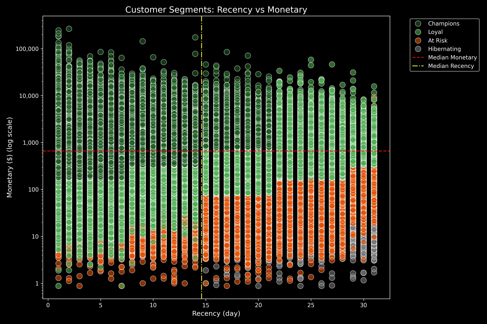
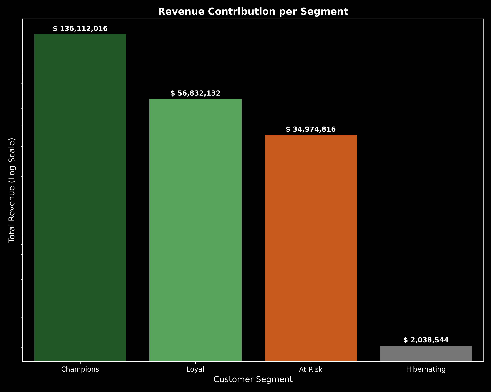
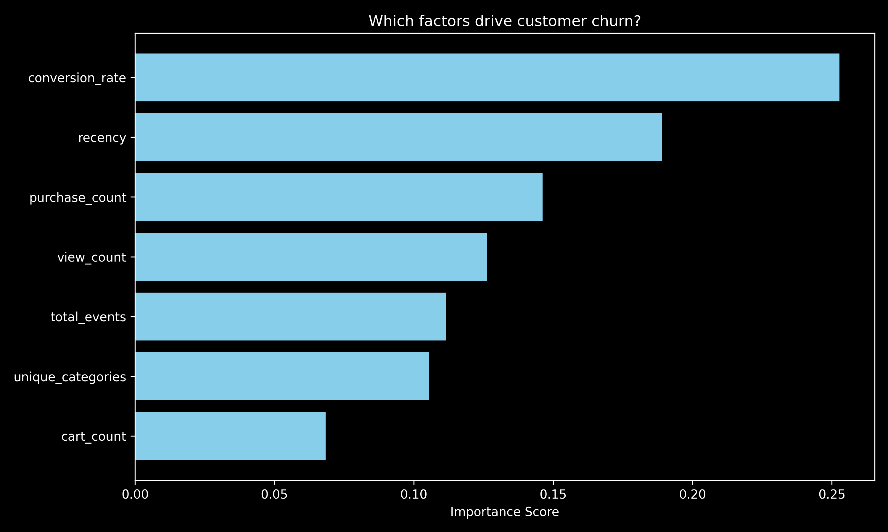

# 🛒 E-Commerce Customer Behavior: From RFM Analytics to Churn Prediction

This project presents an **end-to-end data science pipeline** for large-scale e-commerce data (~42M rows).
 It evolves from **efficient data engineering** and **RFM segmentation** to building a **Machine Learning model** that predicts customer churn with high precision.

The project emphasizes **scalability**, **Medallion Architecture**, and **business-driven model optimization**.

---

## 📁 Project Structure

```
customer-behavior-analysis/
├── data/
│   ├── Bronze/          # Raw event data (initial ingestion)
│   ├── Silver/          # Optimized & cleaned Parquet files
│   └── Gold/            # Final ML-ready datasets & RFM segments
├── models/
│   └── churn_rf_v1.pkl  # Trained Random Forest model
│
├── notebooks/
│ ├── 00_Initial_EDA.ipynb # Behavioral & temporal exploration
│ ├── 01_Data_Optimization.ipynb # Memory-efficient CSV → Parquet conversion
│ ├── 02_RFM_Segmentation.ipynb # RFM scoring & customer segmentation
│ ├── 03_Customer_Segmentation_RFM.ipynb # RFM metric calculation & rule-based customer grouping
│ ├── 04_RFM_Visualization.ipynb      # Semantic branding & executive reporting with log-scaling
│ └── 05_Predictive_Churn_Modeling.ipynb # Feature engineering & Random Forest training for retention
│
├── src/
│ └── Utils.py # Reusable helper functions
│
├── outputs/
│ └── plots/ # Generated visual insights
│
├── requirements.txt # Project dependencies
└── README.md
```

---

## 📈 Pipeline Evolution: From Engineering to Prediction

### 1. Data Engineering & Optimization (Silver Layer)
* **Challenge:** Processing **42 million rows** of raw event data efficiently without crashing memory.
* **Techniques:** Implemented **chunk-based processing** (500k rows/chunk), data type **downcasting**, and timestamp standardization.
* **Storage:** Converted raw CSVs to **Apache Parquet** with Snappy compression, achieving a **75% reduction in size** and significantly faster I/O.

### 2. Behavioral Segmentation & ML Preparedness (Gold Layer)
* **Method:** Applied **RFM (Recency, Frequency, Monetary) Analysis** to transform millions of raw events into actionable customer segments.
* **Outputs:** * `rfm_segmentation.parquet`: Final customer segments for BI and marketing analytics.
    * `churn_model_dataset.parquet`: A refined, feature-engineered dataset specifically optimized for Machine Learning training.
* **Strategic Findings:** Discovered that **Champions** drive **$136.1M** in revenue, while **$35M** is "locked" in **At-Risk** customers.
* **Branding:** Developed a custom semantic color palette and used logarithmic scaling for executive-level reporting.

### 3. Predictive Modeling (Churn Prediction) 🚀
The final stage transforms historical behavior into predictive power using a **Random Forest Classifier**.

* **Targeting:** Focused strictly on "Buyers" to identify retention patterns for high-value customers.
* **Solving the Bias:** Identified an artificial dependency on `total_spend` (caused by long electronics purchase cycles). Optimized the model by shifting focus to **behavioral features** like `conversion_rate` and `recency`.
* **Performance:** Improved accuracy from **69% to 71%**, achieving a **75% Churn Recall** (identifying 3 out of 4 potential churners).

---
### 📊 Key Visualizations

#### 1. Strategic Segmentation (RFM Scatter Plot)
This plot identifies the boundaries between customer segments using log-scaling and median thresholds.


#### 2. Revenue Contribution (Bar Chart)
A financial breakdown showing how the Champions segment drives the majority of total revenue.



#### 3. Churn Feature Importance (Optimized)
After removing price-bias, the model focuses on behavioral engagement.
 
*(Note: Conversion Rate and Recency are the primary drivers of churn prediction)*

---

## 💡 Business Impact & Strategic Insights

By converting raw behavioral data into actionable intelligence, this project provides three key pillars for revenue growth:

* **High-Precision Retention:** The Churn Prediction model identifies **75% of at-risk customers** before they leave. Implementing targeted recovery campaigns for these users can directly protect a significant portion of the platform's recurring revenue.
* **Revenue Optimization:** Analysis revealed that the **Champions** segment acts as the primary revenue engine, contributing **$136.1 Million**. This data justifies a shift in marketing budget to prioritize high-value retention over low-ROI acquisition.
* **Unlocking "Hidden" Capital:** There is approximately **$35 Million** in "Locked Revenue" within the **At-Risk** segment. A data-driven re-engagement strategy aiming to convert just 10% of these users could result in an immediate **$3.5 Million revenue boost**.
* **Cost-Efficiency:** Data proves the **Hibernating** segment contributes less than 1.5% of total revenue ($2M). We recommend automating these interactions with low-cost tools to save operational budget for high-impact segments.

---


## 🛠 Modular Utilities (`src/Utils.py`)

To improve code readability and maintainability, repetitive logic is centralized in `Utils.py`.

**Example utility:**
- `save_plot()`  
  - Standardizes plot exports  
  - Automatically creates output directories  
  - Saves high-resolution, publication-ready figures  

This approach follows **DRY (Don’t Repeat Yourself)** and clean code principles.

---

## 🛠 Tech Stack & Skills
- **Data Engineering:** Parquet, Snappy Compression, Chunking, Medallion Architecture.
- **Machine Learning:** Scikit-Learn (Random Forest), Feature Engineering, Hyperparameter Tuning.
- **Analytics:** RFM Modeling, Conversion Funnels, Temporal Trends.
- **Tools:** Python (Pandas, NumPy), Matplotlib, Seaborn, Joblib. 

---

## 📊 Project Evolution & Key Learnings

This project reflects a clear progression from basic data processing to advanced predictive modeling:

Scalability & Performance: Transitioned from memory-intensive CSV processing to high-speed Parquet I/O and chunk-based ingestion, handling 40M+ rows efficiently.

Medallion Architecture: Implemented a structured data pipeline (Bronze ➔ Silver ➔ Gold) to ensure data quality and lineage throughout the analysis.

Bias Mitigation in ML: Identified and resolved model bias by removing leakage-prone features (like total_spend), increasing prediction reliability for high-value electronics.

Temporal Validation: Developed a robust churn labeling system using Time-based Splitting to simulate real-world forecasting and prevent data leakage.

Production Readiness: Developed modular code with model serialization (Pickling) for future inference and automated directory management.

---

## ▶️ How to Run the Project

1. **Clone the repository**
```bash
git clone <repository-url>
cd customer-behavior-analysis

2. Install dependencies

pip install -r requirements.txt


3. Download the dataset
Place 2019-Oct.csv inside the data/ directory.

4. Run the pipeline
- Execute `01_Data_Optimization.ipynb` to generate optimized Parquet files.
- Run `02_RFM_Segmentation.ipynb` to produce customer segments.
- Run `05_Predictive_Churn_Modeling.ipynb` to train and save the predictive model.

> 💡 Note: The pre-trained model file (.pkl) is excluded from this repo due to size. You can generate it locally by running 05_Predictive_Churn_Modeling.ipynb.
